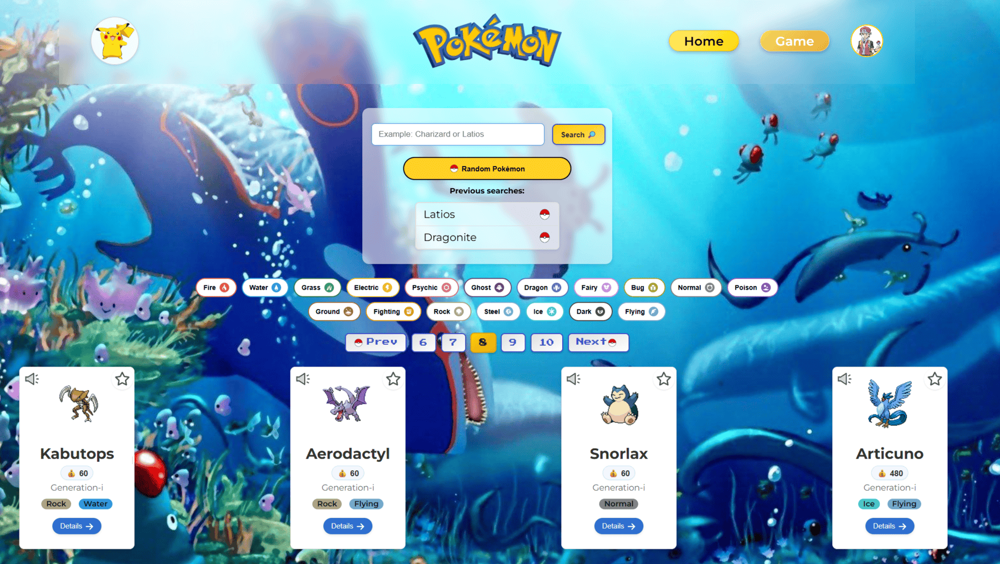
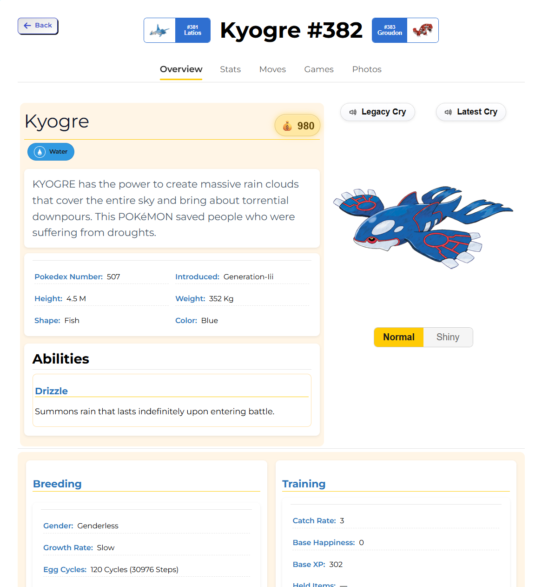
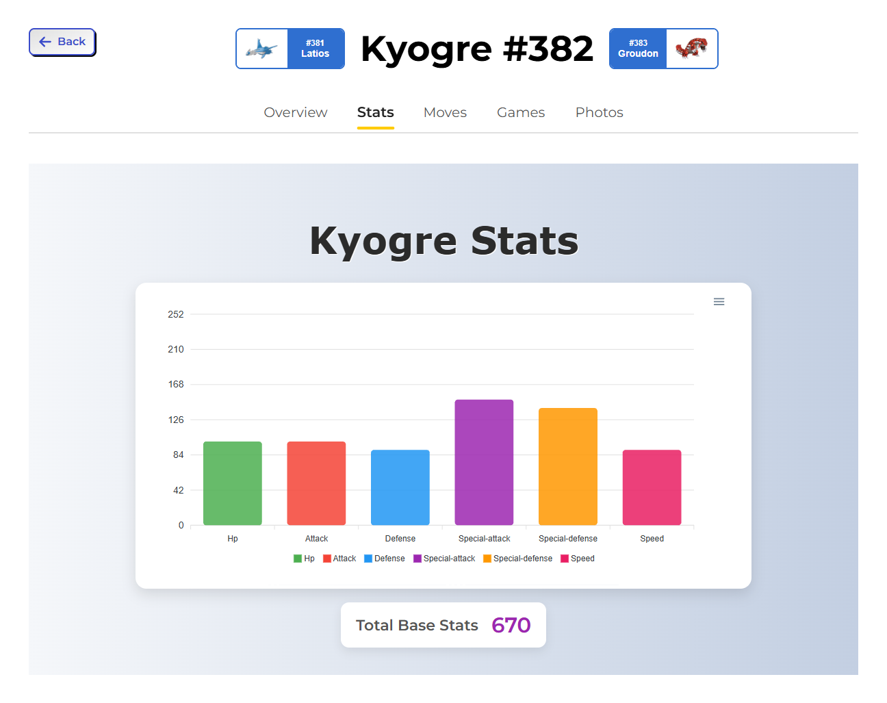
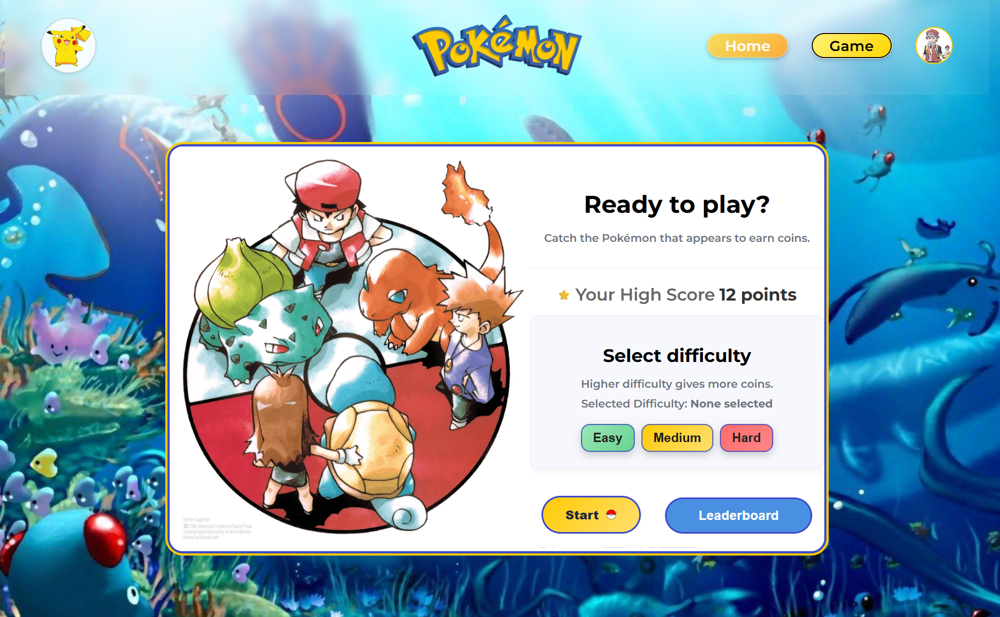
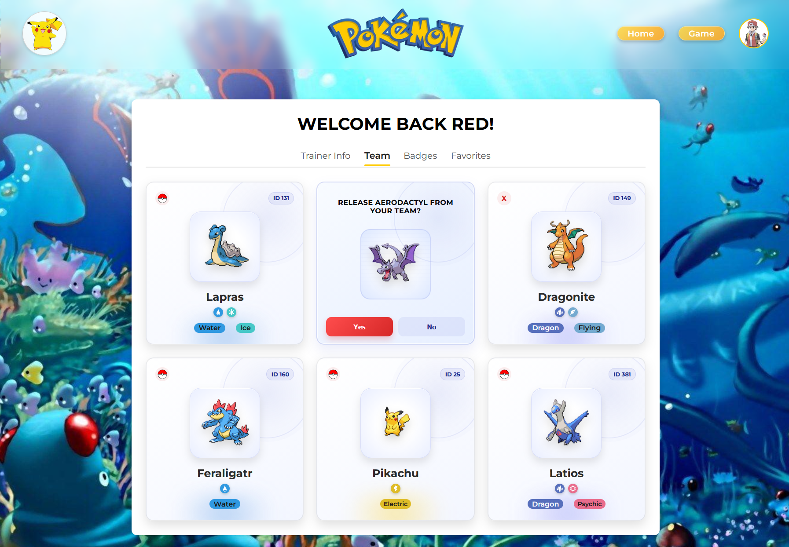
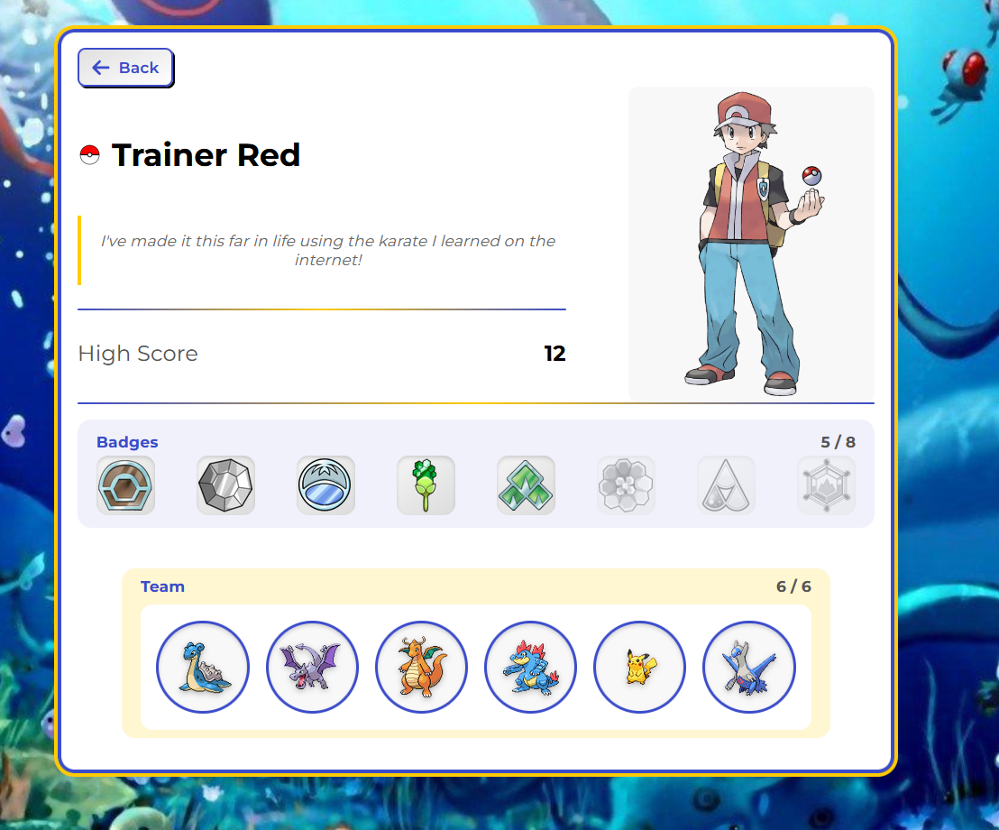

# Pokeverse


A feature-rich Pokémon web application built with React.js that evolved far beyond a traditional API browser.

Users can explore Pokémon, build teams, earn coins through gameplay, unlock progression badges, compete on leaderboards, and create public trainer cards.

Originally intended as a standard API browser to refresh my React.js skills, the app evolved into a complete interactive platform with authentication, progression systems, game mechanics, persistent data, and responsive design.

---

## Live Demo

🚀 [Launch Pokeverse](https://pokeverse-amber.vercel.app/)

---

## Screenshots

## Home Page



---

## Pokémon Details






---

## Catch Game




---

## Profile & Team




---

## Trainer Card



---

# Tech Stack

## Frontend

- React.js
- Vite
- CSS3
- React Router

## Backend / Database

- Firebase Authentication
- Firestore Database

## Libraries

- Framer Motion
- React Toastify
- React Spinners
- Howler
- ApexCharts
- Canvas Confetti
- he

---

# Core Features

## Pokémon Browsing

- Browse Pokémon from PokéAPI
- Search Pokémon by name
- Filter by type
- Random Pokémon generator

## Rich Details Page

Detailed pages including:

- Overview
- Stats charts
- Moves table
- Game appearances
- Photos
- Abilities
- Evolution data
- Forms

## User Accounts

- Register / Login
- Persistent profile data

## Team Builder

- Purchase Pokémon using earned coins
- Build your own 6-Pokémon team
- Favorites collection

## Gameplay Systems

- Catch Pokémon mini-game
- Earn coins based on score and difficulty
- Difficulty settings

## Progression System

- Unlockable trainer badges
- Milestone tracking

## Competitive Features

- Public Top 10 leaderboard
- High score tracking

## Trainer Card System

Create public trainer cards showing:

- Selected avatar
- Trainer quote
- Badges
- Team
- High score

## Responsive Design

Optimized for desktop and mobile devices.

---

# Pages Included

## Main Pages

- Home
- Auth (Login / Register)
- Profile
- Trainer Card

## Pokémon Details

- Overview
- Stats
- Moves
- Games
- Photos

## Game Pages

- Start Screen
- Gameplay
- Game Over
- Leaderboard

## Profile Sections

- Trainer Info
- Team
- Badges
- Favorites

---

# Challenges

## Designing Pokémon-Style UI

Creating custom pages while staying visually faithful to the Pokémon universe.

## Firestore Integration

Connecting game scores, progression, coins, leaderboards, and profile systems to Firestore.

---

# What I’m Proud Of

This project started as a simple React practice app for browsing Pokémon API data.

It grew into something much bigger:

- Gameplay systems
- Progression mechanics
- Authentication
- Public profiles
- Persistent collections
- Team management
- Competitive leaderboard features

I’m proud that the project evolved into something far bigger than a simple API viewer, while also allowing me to combine my passion for coding and Pokémon into a fun and interactive experience.

---

# Future Improvements

- Dual-type filtering
- Smarter search suggestions
- Pokémon packs with rarity system
- More mini-games
- Framer Motion page transitions
- Limited-time shop rotations
- More avatars and quotes
- Daily rewards system

---

# Installation

```bash
npm install
npm run dev
```

After installation, the app will run locally on:
http://localhost:5173
